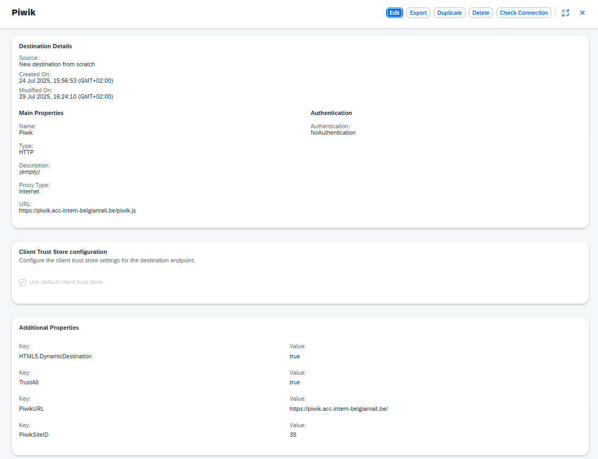

# Welcome to this very simple cap app

The goals of this app was to have an endpoint that returns a property value from a destination. 
Read the destination and return its properties.

## The Piwik destination


## HR Connect API (piwik-hrconnect destination)

De `piwik-hrconnect` destination gebruikt OAuth2 Client Credentials om de HR API aan te spreken.

De `x-api-key` header wordt **niet** in de destination zelf opgeslagen (vermijd plaintext in de Cockpit), maar als environment variable via `mta.yaml`:

```yaml
properties:
  HR_API_KEY: ...
```

Bij deployment wordt die automatisch geïnjecteerd in de CF app en uitgelezen via `process.env.HR_API_KEY` in `srv/interactions.js`.

De Client Secret staat wél in de destination (encrypted/hidden door BTP).

## Start the applicaiton 
```
    cds watch 
OR 
    npm start
```