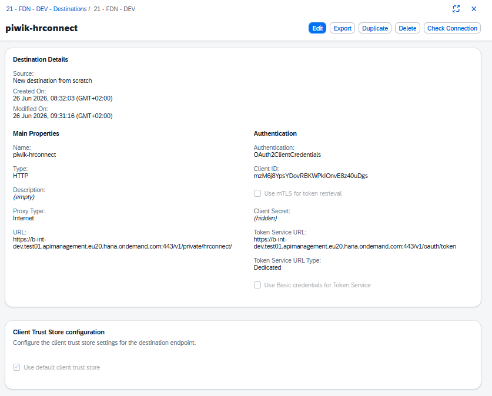

# Welcome to this very simple cap app

This app is used for analytical purposes. 
**PIWIK** 

## The Piwik destination


## HR Connect API (piwik-hrconnect destination)


The `x-api-key` header is not configured in the destination (no plaintext secrets)

Once deployed, the hrconnect api uses the secret from the yaml `process.env.HR_API_KEY` in `srv/interactions.js`.


## deploy shellapp
Create a secrets.mtaext for the hrconnect api 
``` yaml
_schema-version: 3.3.0
extends: analytics-plugin
ID: analytics-plugin-secrets
modules:
- name: analytics-plugin-srv
  properties:
    HR_API_KEY: "secret key"

```
``` bash
cf deploy mta_archives/analytics-plugin_1.0.0.mtar -e secrets.mtaext
```