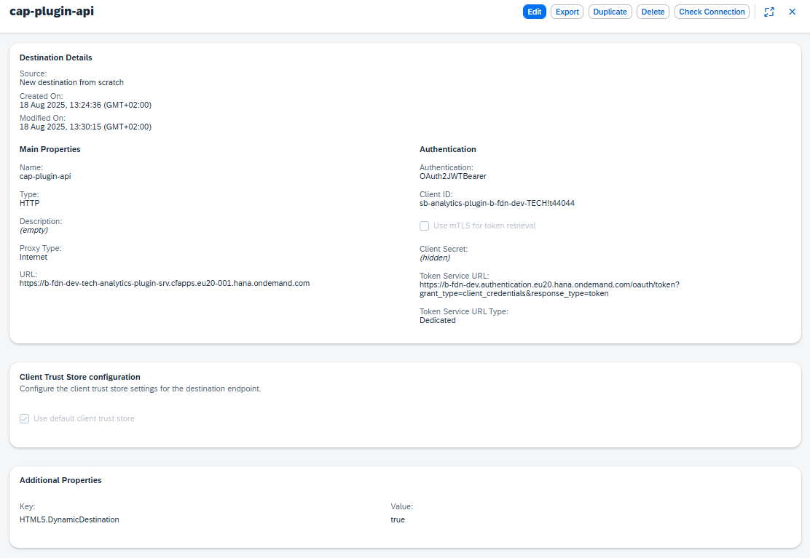

# Welcome to this very simple cap app

The goals of this app was to have an endpoint that returns a property value from a destination. 
Read the destination and return its properties.

## The Piwik destination


## The CAP destination


## This cap application has: 
- No database
- No frontend
- No connection to backend 
- A connection to a destination to return a string
- Connected a seperate app [Shell application](https://github.com/Muyshond/Ypto-ShellApp) (via destination)


## Start the applicaiton 
```
    cds watch 
OR 
    npm start
```

